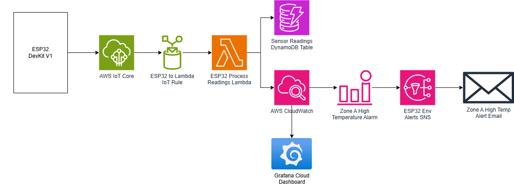
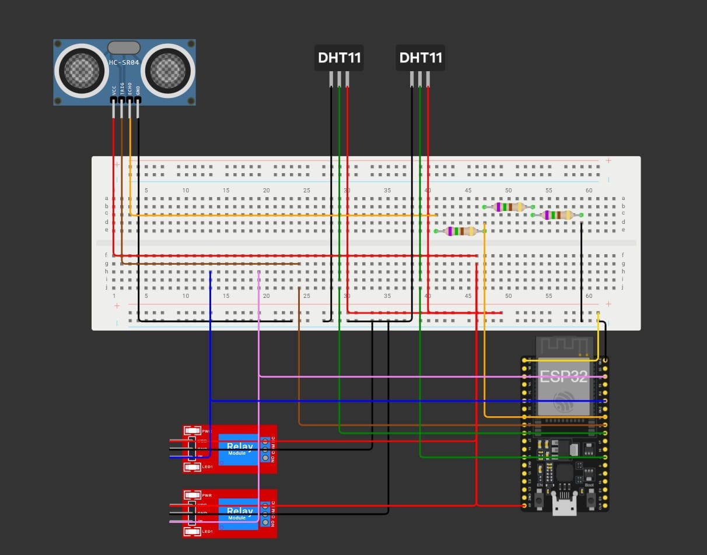
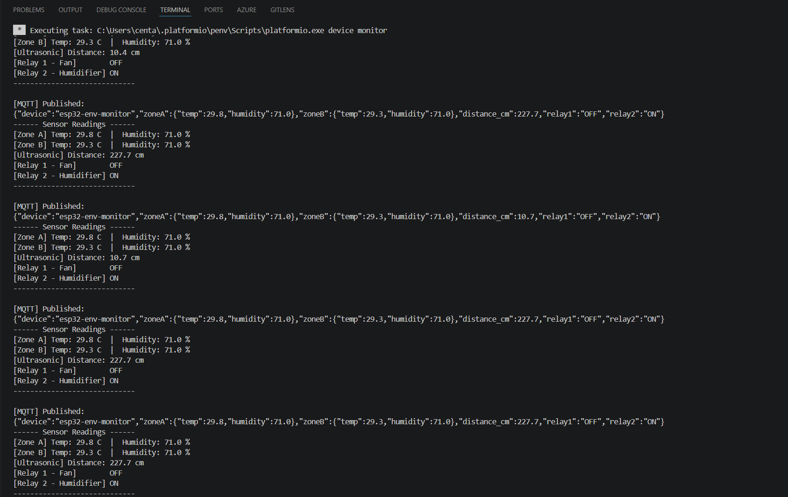
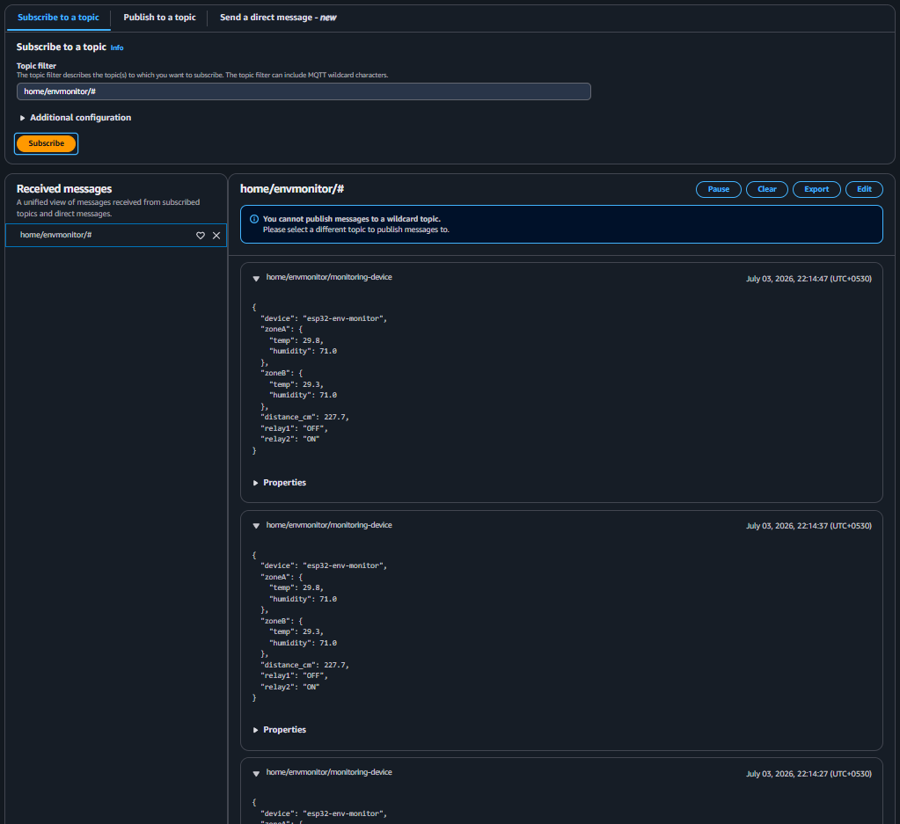
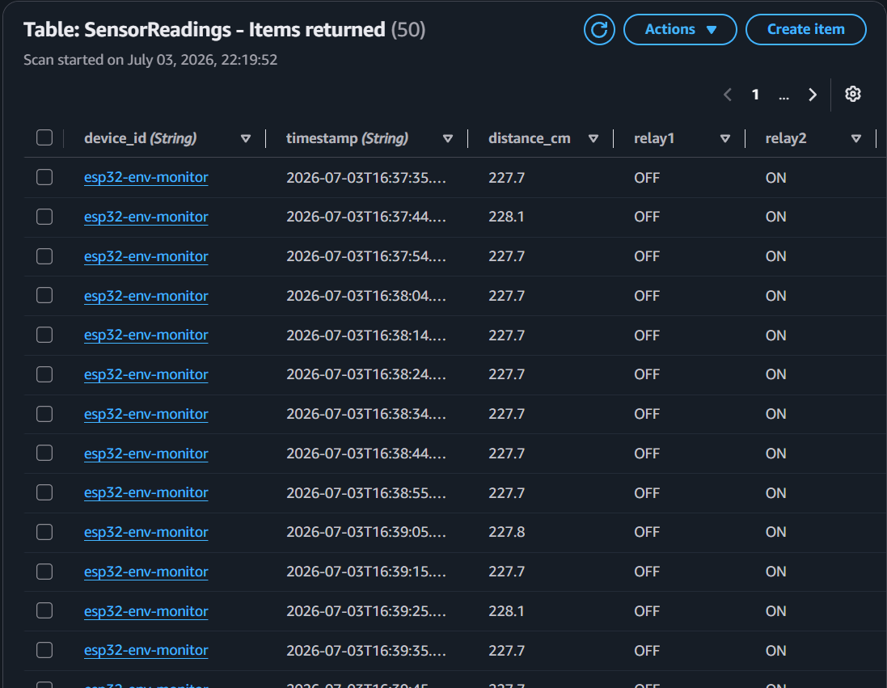
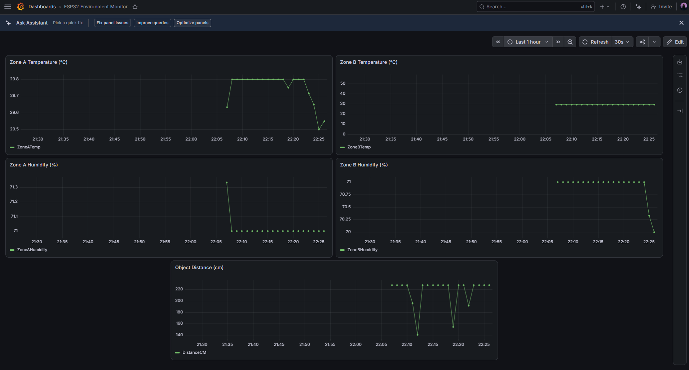

# Smart Environment Monitor

> ESP32-based dual-zone environment monitoring system with a full AWS IoT pipeline, automated relay control, real-time Grafana dashboard, and Terraform-provisioned infrastructure.



---

## What It Does

- Monitors temperature and humidity across two independent zones using dual DHT11 sensors
- Measures proximity and occupancy using an HC-SR04 ultrasonic sensor with a 3× 750Ω voltage divider
- Automatically triggers relay-controlled devices (fan, humidifier) based on configurable thresholds
- Publishes structured JSON sensor data every 10 seconds to AWS IoT Core over MQTT/TLS (port 8883)
- Stores all readings in DynamoDB with 30-day TTL auto-expiry
- Pushes five custom CloudWatch metrics for real-time Grafana dashboards
- Sends email alerts via SNS when Zone A temperature exceeds a defined threshold
- Entire AWS infrastructure is reproducible and version-controlled via Terraform

---

## Architecture

```
ESP32 DevKit V1
      │
      │ MQTT/TLS (port 8883)
      ▼
AWS IoT Core ──► IoT Rule ──► Lambda (esp32-process-readings)
                                    │
                          ┌─────────┴──────────┐
                          ▼                    ▼
                    DynamoDB             CloudWatch
                 (SensorReadings)    (ESP32EnvMonitor)
                                           │
                                  ┌────────┴────────┐
                                  ▼                 ▼
                            CW Alarm           Grafana Cloud
                                │              Dashboard
                                ▼
                           SNS Topic
                                │
                                ▼
                          Email Alert
```

---

## Hardware

| Component | Quantity | Purpose |
|---|---|---|
| ESP32 DevKit V1 | 1 | Microcontroller + WiFi |
| DHT11 (breakout board) | 2 | Zone A + Zone B temp/humidity |
| HC-SR04 | 1 | Proximity/occupancy detection |
| 5V Relay module | 2 | Fan control (Relay 1), humidifier control (Relay 2) |
| 750Ω resistors | 3 | Voltage divider for HC-SR04 Echo pin (5V → 3.3V) |

### Pin Assignments

| Component | ESP32 GPIO |
|---|---|
| DHT11 Zone A (data) | GPIO 4 |
| DHT11 Zone B (data) | GPIO 5 |
| HC-SR04 Trig | GPIO 18 |
| HC-SR04 Echo | GPIO 19 (via voltage divider) |
| Relay 1 (fan) | GPIO 21 |
| Relay 2 (humidifier) | GPIO 22 |

### Wiring Diagram



> The HC-SR04 Echo pin outputs 5V but ESP32 GPIOs are 3.3V tolerant. Three 750Ω resistors in a 1:2 voltage divider (750Ω + 1500Ω) bring the Echo signal down to ~3.3V safely.

---

## AWS Infrastructure

All infrastructure is provisioned via Terraform (`terraform/`). No manual console setup required after the initial certificate creation.

| Resource | Name/ID |
|---|---|
| IoT Core Thing | `esp32-env-monitor` |
| IoT Topic | `home/envmonitor/monitoring-device` |
| IoT Rule | `esp32_to_lambda_rule` |
| Lambda Function | `esp32-process-readings` (Python 3.12) |
| IAM Role | `esp32-lambda-role` |
| DynamoDB Table | `SensorReadings` (partition: `device_id`, sort: `timestamp`) |
| CloudWatch Namespace | `ESP32EnvMonitor` |
| CloudWatch Alarm | `ZoneA-HighTemp-Alarm` (threshold: ZoneATemp > 30°C) |
| SNS Topic | `esp32-env-alerts` |

> **Note:** IoT certificates are managed manually and intentionally excluded from Terraform. AWS only exposes the private key once at certificate creation time — automating this would require storing the private key in state, which is a security risk.

---

## Screenshots

**Serial monitor — live sensor readings and relay state**


**AWS IoT Core MQTT test client — incoming JSON payloads**


**DynamoDB — sensor readings table**


**Grafana Cloud — live dashboard (5 metrics, 30s refresh)**


---

## Setup

### Prerequisites

- AWS account (free tier sufficient for this project's scale)
- Terraform >= 1.0
- PlatformIO (VS Code extension)

### 1 — Firmware

1. Clone the repo:
   ```bash
   git clone https://github.com/jayanth-kuchibhotla/smart-env-monitor.git
   cd smart-env-monitor
   ```

2. Copy the secrets template:
   ```bash
   cp include/secrets_template.h include/secrets.h
   ```

3. Fill in `include/secrets.h` with your WiFi credentials, AWS IoT Core endpoint, and the contents of your three certificate files (Amazon Root CA, device certificate, private key)

4. Open the project in VS Code with PlatformIO and click **Upload**

### 2 — AWS Certificates (manual, one-time)

1. Go to **AWS IoT Core → Security → Certificates → Create certificate**
2. Download all four files (Root CA, device cert, private key, public key)
3. Paste the contents into `include/secrets.h`
4. After Terraform apply, attach the certificate to the Thing (`esp32-env-monitor`) and Policy (`esp32-env-policy`) in the AWS console

### 3 — Infrastructure

1. Copy the Terraform variables template:
   ```bash
   cp terraform/terraform.tfvars.not terraform/terraform.tfvars
   ```

2. Fill in `terraform/terraform.tfvars` with your AWS credentials, account ID, region, and alert email

3. Build the Lambda deployment package:
   ```bash
   cd terraform/lambda
   zip ../lambda_function.zip lambda_function.py
   cd ..
   ```

4. Initialise and apply:
   ```bash
   terraform init
   terraform apply
   ```

5. Confirm the SNS email subscription in your inbox

6. Attach the IoT certificate to the Thing and Policy in the AWS console (see step 2 above)

### 4 — Grafana Dashboard

1. Sign up for a free account at [grafana.com](https://grafana.com)
2. Create an IAM user in AWS with `CloudWatchReadOnlyAccess` and generate an access key
3. In Grafana: **Connections → Data sources → Add → CloudWatch**
   - Authentication: Access and secret key
   - Region: `us-east-1`
4. Create a new dashboard with five panels, all using namespace `ESP32EnvMonitor`:
   - `ZoneATemp`, `ZoneAHumidity`, `ZoneBTemp`, `ZoneBHumidity`, `DistanceCM`
5. Set auto-refresh to 30s

---

## Relay Thresholds

Configurable in `src/main.cpp`:

```cpp
#define TEMP_THRESHOLD 30.0  // °C — triggers Relay 1 (fan)
#define HUM_THRESHOLD  70.0  // %  — triggers Relay 2 (humidifier)
```

---

## Free Tier Considerations

This project was designed to run entirely within AWS Free Tier limits:

| Service | Free Tier Limit | This Project's Usage |
|---|---|---|
| IoT Core | 2.25M messages/month | ~260k/month (10s interval) |
| Lambda | 1M requests/month | ~260k/month |
| DynamoDB | 25GB storage, 200M requests/month | Negligible |
| CloudWatch custom metrics | 10 metrics/month free | 5 metrics |
| CloudWatch alarms | 10 alarms/month free | 1 alarm |
| SNS email | 1,000 notifications/month free | Minimal |

---

## Known Limitations and Future Improvements

- IAM policies use AWS managed policies (`AmazonDynamoDBFullAccess`, `CloudWatchFullAccess`); production deployments should use scoped inline policies with least-privilege permissions
- The IoT Core rule has no error action — failed Lambda invocations are silently dropped; a CloudWatch Logs error action should be added for production
- Single device only; multi-device support would require dynamic topic routing and per-device Thing provisioning
- DHT11 sensors have ±2°C / ±5% RH accuracy; production use cases should use DHT22 or SHT31 for higher precision

---

## Tech Stack

**Firmware:** C++ (Arduino framework), PlatformIO, ESP32 Arduino Core, Adafruit DHT library, PubSubClient (MQTT)

**Cloud:** AWS IoT Core, AWS Lambda (Python 3.12), Amazon DynamoDB, Amazon CloudWatch, Amazon SNS

**IaC:** Terraform (AWS provider ~> 5.0)

**Dashboard:** Grafana Cloud (CloudWatch data source)

---
